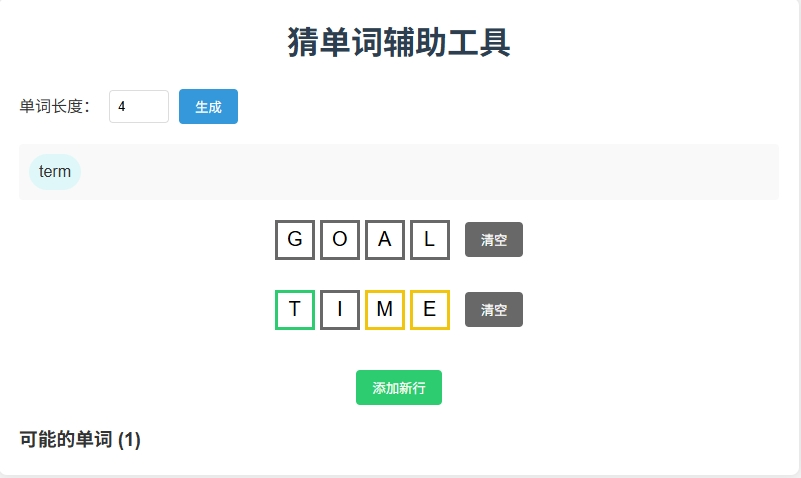

# Binance guess word helper (for FOTD)

## Installation
install **python** requirements:
```
pip install -r requirements.txt
```

## Run
```
python app.py
```
then open browser and go to http://localhost:5000

## Preview


## Customize
customize the word list in `wordlist.txt`

## tools
download-dict.py - download word dictionary for tool
dumpwords.py - dump words from `article.txt` to `wordlist.txt`, use `nltk.stem` to get base form of words
